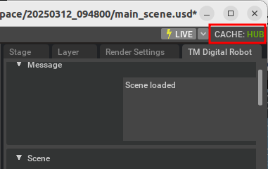

# Installing Hub Workstation Cache

If you experience poor performance during simulation, installing the Hub Workstation Cache is recommended to significantly improve Isaac Sim's performance.

For installation instructions, refer to the official documentation:
[Hub Workstation Cache Installation Guide](https://docs.omniverse.nvidia.com/utilities/latest/cache/hub-workstation.html)

After installing the Hub Workstation Cache, **CACHE HUB** should appear in the top-right corner of the window.

